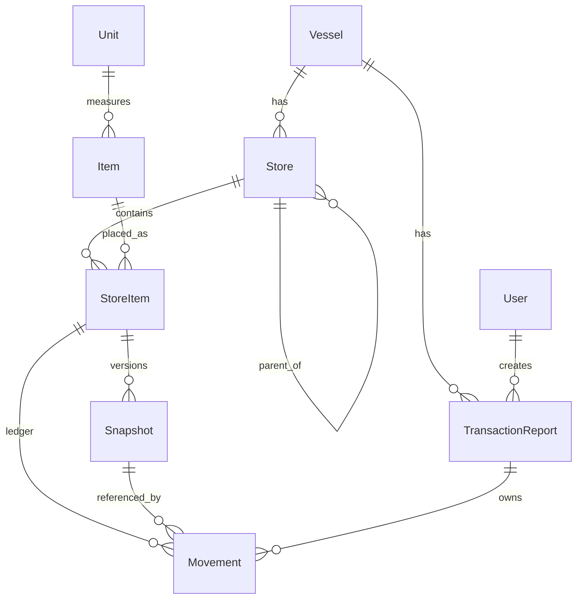

# VIMS data structure

Stack-agnostic backup of the Vessel Inventory Management System (VIMS) domain model. Use this when rewriting on another tool stack.

**Mental model**

1. **Catalog** — vessels, hierarchical stores, items, units  
2. **Placement** — `store_items` (item exists in a store, with min qty)  
3. **Ledger** — `movements` (signed quantity changes)  
4. **Attribute history** — `snapshots` (versioned frozen catalog attrs for a store item)  
5. **Documents** — `transaction_reports` (batch headers that own movements)

There is **no stored balance column**. Balance is always derived from movements.

---

## Entity relationship overview



### Cardinality

| From | To | Cardinality | Notes |
|------|----|-------------|--------|
| Vessel | Store | 1:N | Every store belongs to one vessel |
| Store | Store | 1:N (tree) | `parent_id` nullable (roots have null) |
| Unit | Item | 1:N | Measurement unit for the item |
| Store ↔ Item | StoreItem | N:M | Unique pair `(store_id, item_id)` |
| StoreItem | Snapshot | 1:N | Versioned attribute history |
| StoreItem | Movement | 1:N | Quantity ledger lines |
| Snapshot | Movement | 1:N | Many movements may share one snapshot version |
| TransactionReport | Movement | 1:N | Via polymorphic `movementable` |
| User | TransactionReport | 1:N | `created_by` |

---

## Tables

Types below are conceptual. Current migrations use unbounded `decimal` (no explicit precision/scale) — prefer something like `decimal(12, 3)` on rewrite if you need fixed scale.

All domain tables include `id` (bigint PK) and `created_at` / `updated_at` timestamps unless noted.

### `users` (minimal)

Report creator only for domain purposes.

| Column | Type | Notes |
|--------|------|--------|
| id | bigint PK | |
| name | string | |
| email | string | unique |
| password | string | auth |
| email_verified_at | timestamp | nullable |
| remember_token | string | nullable |
| timestamps | | |

### `vessels`

Ship / asset root. Inventory and reports are scoped under a vessel.

| Column | Type | Notes |
|--------|------|--------|
| id | bigint PK | |
| name | string | |
| timestamps | | |

### `stores`

Hierarchical locations on a vessel (e.g. Deck → Room → Shelf).

| Column | Type | Notes |
|--------|------|--------|
| id | bigint PK | |
| vessel_id | bigint FK → vessels | required |
| parent_id | bigint FK → stores | nullable (root stores) |
| name | string | |
| breadcrumbs | JSON array of strings | denormalized path for display/filter |
| timestamps | | |

### `units`

Quantity measurement catalog.

| Column | Type | Notes |
|--------|------|--------|
| id | bigint PK | |
| short_name | string | e.g. PCS |
| full_name | string | e.g. Pieces |
| data_type | string | `INTEGER` or `DECIMAL` (how quantities are randomized/entered) |
| timestamps | | |

### `items`

Master product catalog (not location-specific).

| Column | Type | Notes |
|--------|------|--------|
| id | bigint PK | |
| unit_id | bigint FK → units | required |
| category | string | enum: see Enums |
| subcategory | string | free text / catalog label |
| name | string | |
| severity | string | enum: see Enums |
| timestamps | | |

### `store_items`

“This item is stocked in this store,” plus reorder threshold. **No balance column.**

| Column | Type | Notes |
|--------|------|--------|
| id | bigint PK | |
| store_id | bigint FK → stores | required |
| item_id | bigint FK → items | required |
| minimum_quantity | decimal | reorder / threshold |
| timestamps | | |

**Constraints**

- Unique `(store_id, item_id)`

### `transaction_reports`

Document header grouping one or more movements (e.g. a Received batch).

| Column | Type | Notes |
|--------|------|--------|
| id | bigint PK | |
| vessel_id | bigint FK → vessels | required |
| created_by | bigint FK → users | required |
| number | string | human-readable report number (see Business rules) |
| transaction_report_type | string | enum: see Enums |
| timestamps | | |

**Constraints**

- Unique `(vessel_id, number)`

### `snapshots`

Point-in-time **denormalized catalog metadata** for a `store_item`. Not a stock balance. Lets historical movements keep readable names after catalog edits.

| Column | Type | Notes |
|--------|------|--------|
| id | bigint PK | |
| version | unsigned bigint | per store_item, starting at 1 |
| store_item_id | bigint FK → store_items | required; **restrict on delete** |
| store_item_minimum_quantity | decimal | frozen copy |
| store_id | unsigned bigint | historical copy — **no FK** |
| store_name | string | frozen |
| store_breadcrumbs | JSON | frozen |
| unit_id | unsigned bigint | historical copy — **no FK** |
| unit_short_name | string | frozen |
| unit_full_name | string | frozen |
| unit_data_type | string | frozen |
| item_category | string | frozen |
| item_subcategory | string | frozen |
| item_name | string | frozen |
| item_severity | string | frozen |
| timestamps | | |

**Constraints**

- Unique `(store_item_id, version)`
- FK `store_item_id` → `store_items.id` with restrict-on-delete

### `movements`

Ledger lines that change stock for a store item.

| Column | Type | Notes |
|--------|------|--------|
| id | bigint PK | |
| store_item_id | bigint FK → store_items | required |
| snapshot_id | bigint FK → snapshots | required |
| quantity | decimal | **signed** ledger amount |
| movement_type | string | enum: see Enums |
| condition | string | enum: see Enums |
| movementable_type | string | polymorphic parent type |
| movementable_id | bigint | polymorphic parent id |
| timestamps | | |

**Polymorphic parent**

Today the only parent is `transaction_reports`. Columns follow the usual morph pair (`movementable_type`, `movementable_id`) with a composite index on that pair.

---

## Enums / controlled vocabularies

Store as strings (or native enums in the new stack). Values are uppercase as shown.

### Category (`items.category`, `snapshots.item_category`)

| Value | Meaning |
|-------|---------|
| `DECK` | Deck |
| `ENGINE` | Engine |

### Severity (`items.severity`, `snapshots.item_severity`)

| Value | Meaning |
|-------|---------|
| `CRITICAL` | Critical |
| `NON_CRITICAL` | Non-critical |

### Condition (`movements.condition`)

| Value | Meaning |
|-------|---------|
| `NORMAL` | Normal |
| `DEGRADED` | Degraded |
| `INOPERABLE` | Inoperable |

### MovementType (`movements.movement_type`)

| Value | Meaning | Quantity convention |
|-------|---------|---------------------|
| `RECEIVED` | Stock in | **Positive** |
| `USED` | Stock out | **Negative** (when implemented) |
| `TRANSFER` | Location change | **Not fully modeled** — see gaps |
| `ASSESSMENT` | Condition / count | **Not fully modeled** — see gaps |

### TransactionReportType (`transaction_reports.transaction_report_type`)

| Value | Meaning | Number code |
|-------|---------|-------------|
| `RECEIVED` | Received report | `REC` |
| `USED` | Used report | `USED` |

---

## Business rules

### Balance

```
balance(store_item) = COALESCE(SUM(movements.quantity WHERE store_item_id = ?), 0)
```

- No cached balance column in the current schema.
- Ledger is **signed**: RECEIVED stores positive quantities; depleting types (USED, etc.) must store negative quantities so the same SUM remains correct.
- Do not invent type-aware `CASE` balance SQL unless you abandon signed quantities.

### Snapshot versioning

When writing a movement for a store item:

1. Load current store + item + unit attributes into a snapshot attribute set.
2. Load latest snapshot for that `store_item_id` by highest `version`.
3. If none exists → create version **1**.
4. If latest exists and all frozen attributes are unchanged → **reuse** that snapshot.
5. If any frozen attribute changed → create version **N+1**.

Multiple movements may share the same snapshot version when catalog metadata is unchanged.

Frozen attribute set (must stay in sync with snapshot columns):

- `store_item_minimum_quantity`
- `store_id`, `store_name`, `store_breadcrumbs`
- `unit_id`, `unit_short_name`, `unit_full_name`, `unit_data_type`
- `item_category`, `item_subcategory`, `item_name`, `item_severity`

### Report numbering

Format:

```
{seq:3-digit}/{code}/{romanMonth}/{year}
```

Examples: `001/REC/IX/2026`, `002/USED/I/2026`

- `code`: `REC` for RECEIVED, `USED` for USED  
- `romanMonth`: I … XII for calendar month of issuance  
- Sequence is **per vessel and per transaction_report_type** (max of leading `seq` among that vessel+type, then +1)  
- DB unique: `(vessel_id, number)`  
- Issuing the next number should lock rows for that vessel+type to avoid races  

### Received write flow (logical)

1. Validate line items: store_item ids distinct, quantity **> 0**.
2. Begin transaction; lock involved `store_items` rows.
3. Create `transaction_reports` row (`vessel_id`, `created_by`, `number`, type RECEIVED).
4. For each line: resolve snapshot via versioning rules above; create `movements` row with positive quantity, `movement_type = RECEIVED`, `condition = NORMAL`, morph parent = the report.
5. Commit.

### Gaps intentionally not modeled

| Topic | Status |
|-------|--------|
| TRANSFER | Enum exists; no from/to store or paired-line model — do not invent ad-hoc TRANSFER rows without a design |
| ASSESSMENT | Enum exists; behavior (condition-only vs absolute count) undefined |
| Void / cancel report | No soft-delete or reversal entity; reverse via opposite signed movements if needed |
| Multi-vessel UX | Schema supports it; some app paths historically hard-coded vessel `1` |

---

## Integrity checklist (for rewrite)

Implement at minimum:

- [ ] FK: `stores.vessel_id` → `vessels`
- [ ] FK: `stores.parent_id` → `stores` (nullable)
- [ ] FK: `items.unit_id` → `units`
- [ ] FK: `store_items.store_id` → `stores`
- [ ] FK: `store_items.item_id` → `items`
- [ ] Unique: `store_items (store_id, item_id)`
- [ ] FK: `transaction_reports.vessel_id` → `vessels`
- [ ] FK: `transaction_reports.created_by` → `users`
- [ ] Unique: `transaction_reports (vessel_id, number)`
- [ ] FK: `snapshots.store_item_id` → `store_items` (restrict delete)
- [ ] Unique: `snapshots (store_item_id, version)`
- [ ] No FK on snapshot `store_id` / `unit_id` (historical copies)
- [ ] FK: `movements.store_item_id` → `store_items`
- [ ] FK: `movements.snapshot_id` → `snapshots`
- [ ] Index on morph pair `(movementable_type, movementable_id)`
- [ ] Index on `movements.store_item_id` (for balance SUM)

Optional improvements on rewrite:

- Explicit `decimal(p, s)` (e.g. `(12, 3)`) for quantity / minimum fields
- Decide TRANSFER / ASSESSMENT schemas before using those movement types
- Cached `store_items.balance` only if list performance requires it (keep SUM as source of truth or sync in the same write transaction)

---

## Out of scope for this document

- HTTP routes, UI, Inertia/React, or framework packages  
- Seeders, factories, sample catalog data  
- Full authentication / authorization design beyond `users` as report creator  
